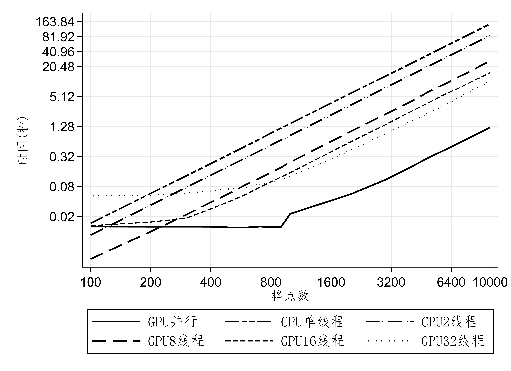
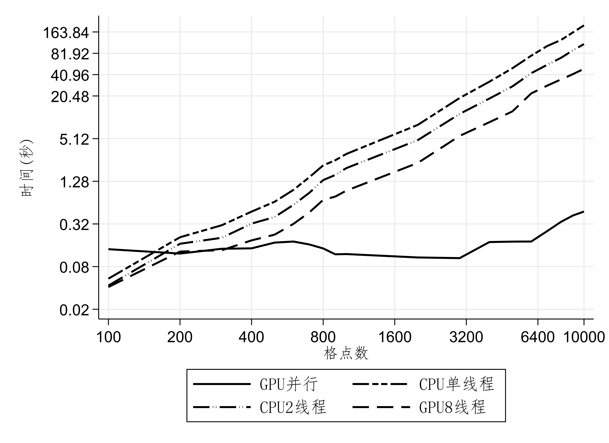
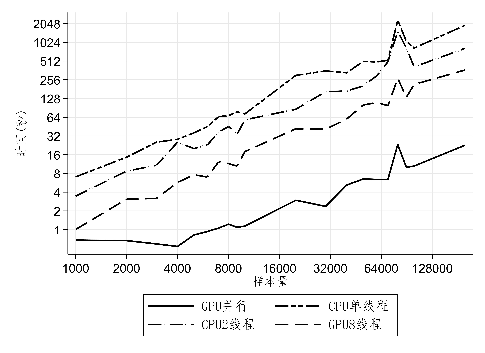

# CUDA-HA

[CUDA](https://developer.nvidia.com/cuda-toolkit)是NVIDIA推出的基于GPU的并行计算平台和编程模型，可大幅提升计算性能，已经在经济学研究领域广泛应用。为了便于交流学习，我们采用Julia包[CUDA.jl](https://github.com/JuliaGPU/CUDA.jl)，对比了GPU并行与CPU多线程求解SOG(随机增长模型)、DC(动态离散-连续选择)模型和微观BLP模型的性能表现。后续会陆续补充更多异质性经济人模型相关前沿数值方法的CUDA并行设计。

## SOG（随机增长模型）

+ 参考模型：Fernández-Villaverde, J. and Valencia, D. Z., 2018, “A Practical Guide to Parallelization in Economics”.
+ 运行：执行文件夹下的Makefile
+ 计算速度

## DCEGM

+ 参考模型：Iskhakov, F., Jørgensen, T. H., Rust, J. and Schjerning, B., 2017, “The Endogenous Grid Method for Discrete-Continuous Dynamic Choice Models with (or without) Taste Shocks”, Quantitative Economics, 8(2), pp.317~365.
+ 运行：执行文件夹下的Makefile
+ 计算速度

## BLP

+ 参考模型：Nevo, A., 2000, “A Practitioner’s Guide to Estimation of Random-Coefficients Logit Models of Demand”, Journal of Economics & Management Strategy, 9(4), pp.513~548.
+ 运行：执行文件夹下的Makefile
+ 计算速度